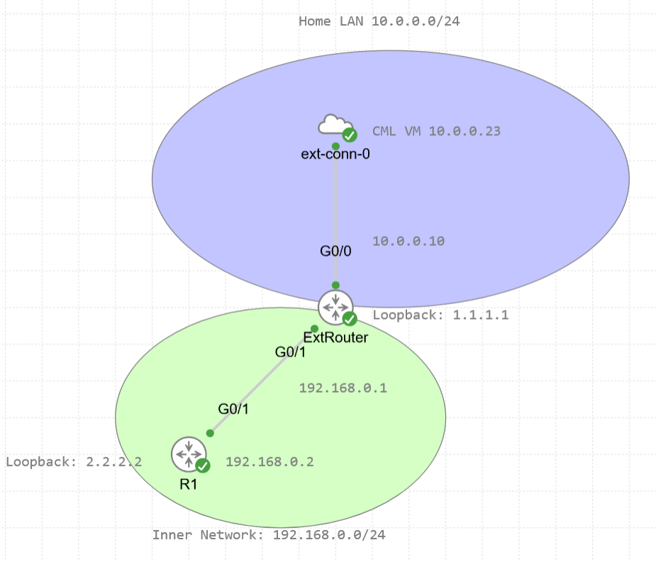
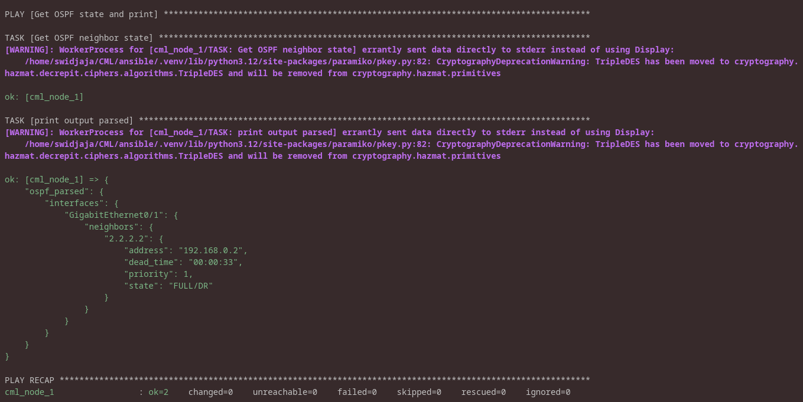

# Cisco Modeling Labs — Ansible Automation

Ansible playbooks for automating Cisco IOS routers in a Cisco Modeling Labs (CML) topology. This repo holds the automation; the full write-up and lab notes live on my **[website](https://seanslab.site/projects/cisco-labs-practice/)**

## Overview

The playbooks configure and verify a small routed lab: hostname, interface addressing, and OSPF. They target a `routers` group in my inventory over `network_cli` using the `cisco.ios` collection.

| Playbook | Purpose |
|----------|---------|
| [`change_hostname.yml`](ansible/playbooks/change_hostname.yml) | Sets the router hostname via `ios_hostname` |
| [`assign_ipv4.yml`](ansible/playbooks/assign_ipv4.yml) | Configures an IPv4 address on `Gi0/1` and saves to NVRAM |
| [`enable_ospf.yml`](ansible/playbooks/enable_ospf.yml) | Creates OSPF process 10 and enables it on `Loopback0`, `Gi0/0`, `Gi0/1` |
| [`get_ospf_state.yml`](ansible/playbooks/get_ospf_state.yml) | Parses `show ip ospf neighbor` with `cli_parse` (pyATS) and prints structured OSPF state |

## Topology



**ExtRouter** is the edge device: its `G0/0` sits on the home LAN, and its `G0/1` faces the inner network toward **R1**. Ansible reaches ExtRouter over the LAN, and R1 lives one hop behind it on `192.168.0.0/24`.

## Addressing

| Device    | Interface | IP address    | Notes             |
|-----------|-----------|---------------|-------------------|
| ExtRouter | G0/0      | 10.0.0.10     | Home LAN side     |
| ExtRouter | G0/1      | 192.168.0.1   | Link to R1        |
| ExtRouter | Loopback0 | 1.1.1.1       | OSPF router-id    |
| R1        | G0/1      | 192.168.0.2   | Link to ExtRouter |
| R1        | Loopback0 | 2.2.2.2       | OSPF router-id    |

CML VM host: `10.0.0.23` · Home LAN: `10.0.0.0/24` · Inner network: `192.168.0.0/24`

## Lab setup

The CML VM runs at `10.0.0.23` on my Proxmox server, and the topology connects out to the LAN through the `ext-conn-0` external connector.

Before Ansible can take over, the external facing interface must be brought up manually on the border router because Ansible needs a reachable, addressed interface to connect to in the first place.

- ExtRouter `G0/0`: `10.0.0.10` - assigned manually and placed on the home LAN so Ansible can reach my LAN
- ExtRouter `G0/1`: `192.168.0.1` - assigned with the `assign_ipv4.yml` playbook once the `G0/0` interface was up. 

## Prerequisites

- Python 3 with a virtual environment
- Ansible
- Collections installed from [`requirements.yml`](ansible/requirements.yml)
```bash
ansible-galaxy install -r ansible/requirements.yml
```
- `pyats`/`genie` installed in venv. The `cli_parse` step in `get_ospf_state.yml` uses the ansible.netcommon.pyats parser which depends on Python packages
```bash
pip install pyats genie
```
- A running CML topology reachable from your control machine
- SSH enabled on the target devices

## Inventory

Inventory is not committed because it contains credentials. Create your own at `ansible/inventory/inventory`. Example below:

```ini
[routers]
ExtRouter ansible_host=10.0.0.10

[routers:vars]
ansible_connection=network_cli
ansible_network_os=cisco.ios.ios
ansible_user=<username>
ansible_password=<password>
```

## Usage

Run a playbook against your inventory:

```bash
ansible-playbook -i ansible/inventory/inventory ansible/playbooks/assign_ipv4.yml
```

Check OSPF adjacencies once OSPF is up:

```bash
ansible-playbook -i ansible/inventory/inventory ansible/playbooks/get_ospf_state.yml
```



## Repo layout

```
.
├── README.md
├── images/
│   ├── CMLScreenshot.png
│   └── GetOSPFState.png
└── ansible/
    ├── requirements.yml
    ├── inventory/
    │   └── inventory        # not committed
    └── playbooks/
        ├── assign_ipv4.yml
        ├── change_hostname.yml
        ├── enable_ospf.yml
        └── get_ospf_state.yml
```